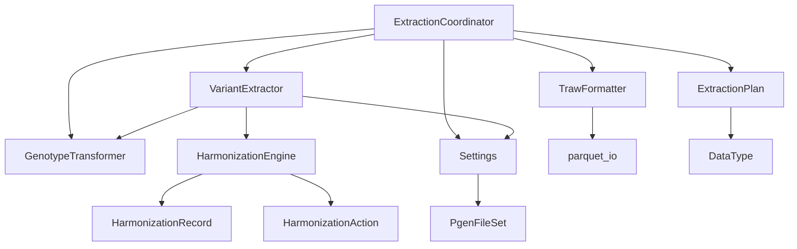

# Precision Medicine API - Architecture & Code Documentation

## 🏗️ System Architecture Overview

```
┌─────────────────────────────────────────────────────────────────┐
│                    PIPELINE ENTRY POINT                         │
│  run_carriers_pipeline.py → ExtractionCoordinator               │ 
└─────────────────────────────────────────────────────────────────┘
                            │
                            ▼
┌─────────────────────────────────────────────────────────────────┐
│                    COORDINATION LAYER                           │
│  app/processing/coordinator.py                                  │
│  • ExtractionCoordinator (main orchestrator)                    │
│  • ProcessPool management & parallel execution                  │
│  • Multi-source data integration                                │
└─────────────────────────────────────────────────────────────────┘
                            │                
                            ▼                
┌─────────────────┐ ┌───────────────────┐ ┌───────────────────┐
│   EXTRACTION    │ │   HARMONIZATION   │ │   TRANSFORMATION  │
│                 │ │                   │ │                   │
│VariantExtractor │ │HarmonizationEngine│ │GenotypeTransformer│
│ • PLINK2 calls  │ │ • Allele compare  │ │ • Swap genotypes  │
│ • File reading  │ │ • Strand flips    │ │ • Validation      │
│ • Simulation    │ │ • Real-time       │ │ • QC metrics      │
└─────────────────┘ └───────────────────┘ └───────────────────┘
                            │                       
                            ▼                       
┌─────────────────────────────────────────────────────────────────┐
│                    OUTPUT LAYER                                 │
│  app/processing/output.py                                       │
│  • TrawFormatter (TRAW, Parquet, CSV, JSON output)              │
│  • QC reports & harmonization statistics                        │
│  • Hardy-Weinberg equilibrium calculations                      │
└─────────────────────────────────────────────────────────────────┘
                            │
                            ▼
┌─────────────────────────────────────────────────────────────────┐
│                   CONFIGURATION & UTILITIES                     │
│  app/core/config.py • app/utils/parquet_io.py                   │
│  • Settings & optimization • app/utils/paths.py                 │
│  • Path management • app/models/ (data structures)              │
└─────────────────────────────────────────────────────────────────┘
```

## 🔄 Data Flow & Relationships

### **Main Processing Flow:**
1. **`run_carriers_pipeline.py`** → Entry point
2. **`ExtractionCoordinator`** → Orchestrates entire pipeline
3. **`VariantExtractor`** → Extracts genotypes from PLINK files
4. **`HarmonizationEngine`** → Harmonizes alleles between SNP list and PLINK files
5. **`GenotypeTransformer`** → Applies genotype transformations
6. **`TrawFormatter`** → Formats and exports results

### **Inter-Class Dependencies:**



## 📋 Complete Class & Function Reference

### **Core Configuration (`app/core/`)**

#### **`Settings` Class** (config.py:7)
**Purpose**: Central configuration management with auto-optimization

**Key Methods:**
- `create_optimized()` → Auto-detects machine specs and optimizes performance
- `get_optimal_workers(total_files)` → Calculates optimal ProcessPool workers
- `get_nba_path(ancestry)` → NBA file paths
- `get_wgs_path()` → WGS file paths  
- `get_imputed_path(ancestry, chrom)` → Imputed file paths
- `validate_file_paths()` → Validates PLINK file existence
- `list_available_ancestries(data_type)` → Available ancestry groups
- `list_available_chromosomes(ancestry)` → Available chromosomes

**Performance Properties:**
- `max_workers` → ProcessPool worker count
- `chunk_size` → Processing chunk size
- `process_cap` → Maximum concurrent processes

---

### **Processing Pipeline (`app/processing/`)**

#### **`ExtractionCoordinator` Class** (coordinator.py:96)
**Purpose**: Main orchestrator for the entire extraction pipeline

**Key Methods:**
- `run_full_extraction_pipeline()` → **Main entry point** - runs complete pipeline
- `execute_harmonized_extraction()` → Orchestrates ProcessPool parallel extraction
- `plan_extraction()` → Creates extraction plan for multi-source processing
- `export_results_cache_free()` → Exports results with real-time harmonization
- `load_snp_list()` → Loads and validates SNP list
- `_execute_with_process_pool()` → Manages ProcessPool execution

**Process Workers:**
- `extract_single_file_process_worker()` → **ProcessPool worker function**
- `_parse_ancestry_from_path()` → Helper for ancestry detection

#### **`VariantExtractor` Class** (extractor.py:29)
**Purpose**: Extracts variants from PLINK files with harmonization integration

**Key Methods:**
- `extract_single_file_harmonized()` → **Main extraction method** - extracts with real-time harmonization
- `_extract_raw_genotypes()` → Raw genotype extraction from PLINK files
- `_extract_with_plink2()` → PLINK2 command execution with memory optimization
- `_harmonize_extracted_genotypes()` → Applies harmonization to extracted genotypes
- `_check_plink_availability()` → PLINK2 availability check
- `_simulate_plink_extraction()` → Fallback simulation for testing

**Internal Helpers:**
- `_read_traw_file()` → Reads PLINK TRAW format
- `_reconstruct_snp_list_from_ids()` → SNP list reconstruction
- `_harmonization_records_to_plan_df()` → Convert harmonization records to plan

#### **`HarmonizationEngine` Class** (harmonizer.py:15)
**Purpose**: Real-time allele harmonization using merge-based approach

**Key Methods:**
- `harmonize_variants()` → **Main harmonization method** - harmonizes SNP list vs PVAR
- `read_pvar_file()` → Reads PVAR files with VCF-style header support
- `_merge_data()` → Merges PVAR and SNP list on chromosome/position
- `_harmonize_on_merged()` → Direct allele comparison and action determination
- `_prepare_snp_list()` → Normalizes SNP list for merging

**Harmonization Actions:**
- EXACT → No transformation needed
- SWAP → Allele swap (genotype: 2-x)
- FLIP → Strand flip (no genotype transform)
- FLIP_SWAP → Both strand flip and allele swap (genotype: 2-x)

#### **`GenotypeTransformer` Class** (transformer.py:18)
**Purpose**: Applies genotype transformations for allele harmonization

**Key Methods:**
- `apply_transformation_by_formula()` → **Main transform method** - applies formula-based transformations
- `get_transformation_summary()` → Statistics on transformations needed
- `transform_for_swap()` → Allele swap transformation (0↔2)
- `transform_for_flip()` → Strand flip (no genotype change)
- `validate_transformation()` → Validates transformation correctness
- `get_allele_counts()` → Calculates allele frequencies
- `transform_matrix()` → Batch transformation for multiple variants

**Transformation Formulas:**
- `"2-x"` → Swap transformation (0→2, 1→1, 2→0)
- `"x"` or `None` → Identity (no change)

#### **`TrawFormatter` Class** (output.py:23)
**Purpose**: Formats and exports harmonized results in multiple formats

**Key Methods:**
- `export_multiple_formats()` → **Main export method** - exports TRAW, Parquet, CSV, JSON
- `write_traw()` → PLINK TRAW format output
- `create_qc_report()` → Quality control statistics
- `write_harmonization_report()` → Harmonization process statistics
- `write_variant_summary()` → Per-variant summary statistics
- `format_harmonized_genotypes()` → Prepares data for output
- `_calculate_hwe_p()` → Hardy-Weinberg equilibrium p-values

---

### **Data Models (`app/models/`)**

#### **Analysis Models** (analysis.py)
- `DataType` → Enum: NBA, WGS, IMPUTED
- `AnalysisRequest` → Request specification for variant analysis
- `AnalysisResult` → Complete analysis results container

#### **Harmonization Models** (harmonization.py)
- `HarmonizationAction` → Enum: EXACT, SWAP, FLIP, FLIP_SWAP, INVALID, AMBIGUOUS
- `HarmonizationRecord` → Variant harmonization metadata
- `ExtractionPlan` → Multi-source extraction planning
- `HarmonizationStats` → Harmonization process statistics

#### **Carrier Models** (carrier.py)
- `GenotypeValue` → Enum: Genotype values (0/0, 0/1, 1/1, ./.)
- `Genotype` → Individual genotype record
- `Carrier` → Extended genotype with clinical metadata
- `CarrierReport` → Complete carrier analysis report

#### **Variant Models** (variant.py)
- `InheritancePattern` → Enum: AD, AR, XL, MT
- `Variant` → Genomic variant with coordinates
- `VariantList` → Collection of variants with metadata

---

### **Utilities (`app/utils/`)**

#### **Path Management** (paths.py)
- `PgenFileSet` → PLINK file validation and metadata
- `validate_pgen_files()` → File existence validation

#### **Parquet I/O** (parquet_io.py)
- `save_parquet()` → Optimized genomic data storage
- `read_parquet()` → Efficient data loading with filtering
- `optimize_dtypes_for_genomics()` → Memory optimization for genomic data

---

## 🔧 **Key Design Patterns**

### **1. ProcessPool Parallelization**
- **Pattern**: True parallel processing using ProcessPoolExecutor
- **Implementation**: `coordinator.py:_execute_with_process_pool()`
- **Worker Function**: `extract_single_file_process_worker()` (module-level for serialization)
- **Benefits**: True concurrency, memory isolation, optimal resource usage

### **2. Real-Time Harmonization**
- **Pattern**: Merge-based harmonization without pre-processing
- **Implementation**: `harmonizer.py:HarmonizationEngine`
- **Flow**: PVAR + SNP list → merge on chr:pos → allele comparison → action determination
- **Benefits**: No caching overhead, always up-to-date, memory efficient

### **3. Multi-Source Data Integration**
- **Pattern**: Unified extraction across NBA/WGS/IMPUTED with separate outputs
- **Implementation**: `coordinator.py:ExtractionCoordinator`
- **Benefits**: Consistent processing, separate data type outputs, comprehensive coverage

### **4. Memory-Efficient Processing**
- **Pattern**: Stream processing, chunk-based operations, optimal data types
- **Implementation**: Throughout pipeline, especially `parquet_io.py`
- **Benefits**: <8GB RAM usage, handles large datasets, fast processing

---

## 📊 **Performance Characteristics**

### **Processing Targets:**
- **Speed**: <10 minutes for 400 variants across all files
- **Memory**: <8GB RAM usage
- **Concurrency**: 10+ simultaneous jobs supported
- **Scalability**: Auto-optimization based on machine specs

### **Current System Optimization:**
- **CPU**: 32 cores → 28 workers (auto-detected)
- **RAM**: 128GB → 50K chunk_size
- **Files**: 242+ PLINK files processed in parallel
- **Output**: Separate datasets per data type (NBA/WGS/IMPUTED)

This architecture provides a robust, scalable, and maintainable system for genomic carrier screening with excellent performance characteristics and clear separation of concerns.